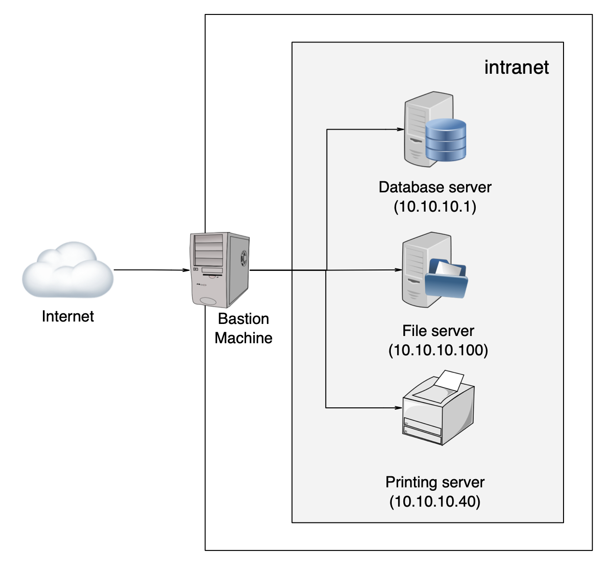

Pypow!
======

PyPow! is the easy way to expose any cli command as a REST API.

What's this PyPow! by example
-----------------------------

Oks, lets me explain what's is PyPow! with an example:

Imagine we have a bastion machine for our internal network, something similar like this diagram:

**Problem we have**

1 - We need to check that our database is alive
2 - We need to do that without login into any machine of the intranet.
3 - For us, it's enough to to **ping** the database machine for check that it's alive.

**Solution using PyPow! / KaPow!**

Step 1
++++++

Write the ping.pow file like this:

.. code-block:: console

    kapow route add '/ping' - <<-'EOF'
        kapow set /response/headers/Content-Type text/plain
        nohup ping 10.10.10.1 >> /tmp/ping.txt &
        tail -f /tmp/ping.txt  | kapow set /response/stream
    EOF

Step 2
++++++

Launch service using Pypow! server:

.. code-block:: console

    $ kapow server ping.pow

Step 3
++++++

Check your browser and freaks out :)

Install Pypow!
--------------

.. code-block:: console

    $ pip install pypow

Examples
--------

SSL Auth
++++++++

**Create CA (tl,dr)**

    Commands and examples borrowed from: https://tech-habit.info/posts/https-cert-based-auth-with-flask-and-gunicorn/

.. code-block:: console

    $ openssl req -nodes -new -x509 -days 365 -keyout ca.key -out ca-crt.pem

**Create Pypow certificate**

.. code-block:: console

    # create server private key and server CSR
    $ openssl req -nodes -new -keyout server.key -out server.csr

    # generate certicate based on server's CSR using CA root certificate and CA private key
    $ openssl x509 -req -days 365 -in server.csr -CA ca-crt.pem -CAkey ca.key -CAcreateserial -out server.crt

    # verify the certificate (optionally)
    $ openssl verify -CAfile ca-crt.pem server.crt

**Create client certificate**

.. code-block:: console

    # create client private key and client CSR
    $ openssl req -nodes -new -keyout client.key -out client.csr

    # generate certicate based on client's CSR using CA root certificate and CA private key
    $ openssl x509 -req -days 365 -in client.csr -CA ca-crt.pem -CAkey ca.key -CAcreateserial -out client.crt

    # verify the certificate (optionally)
    $ openssl verify -CAfile ca-crt.pem client.crt

**Launching PyPow with certificates**

See examples/ folder to check the samp:`ping.pow` file.

.. code-block:: console

    $ kapow server --capem ca-crt.pem --certfile server.crt --keyfile server.key --bind 127.0.0.1:9001 ping.pow

**Connect to PyPow server with certificate**

.. code-block:: console

    $ curl --insecure --cacert ca-crt.pem --key client.key --cert client.crt https://localhost:9001/ping

PyPow origins
-------------

PyPow is a Python implementation of Kapow! spec. It's based in the original Kapow Python PoC.

This repo contains the Python implementation of `Kapow! Spec <https://github.com/BBVA/kapow/tree/master/spec>`_:

    if you're looking for high performance, then you need the official GoLang implementation of Kapow!

    https://github.com/BBVA/kapow
